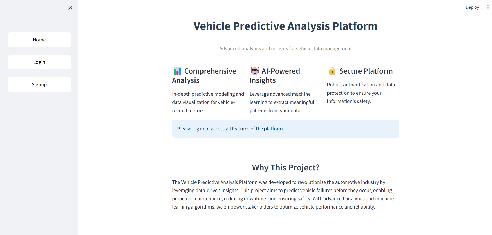
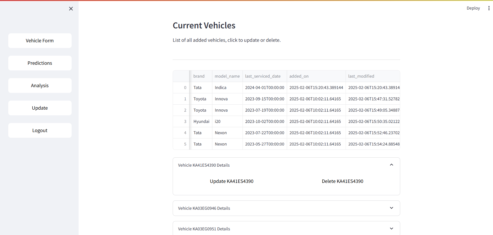
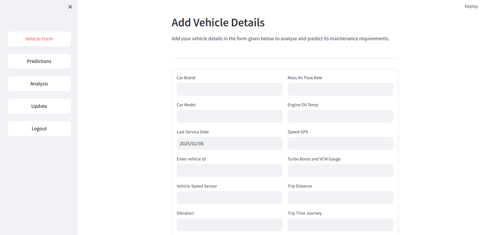
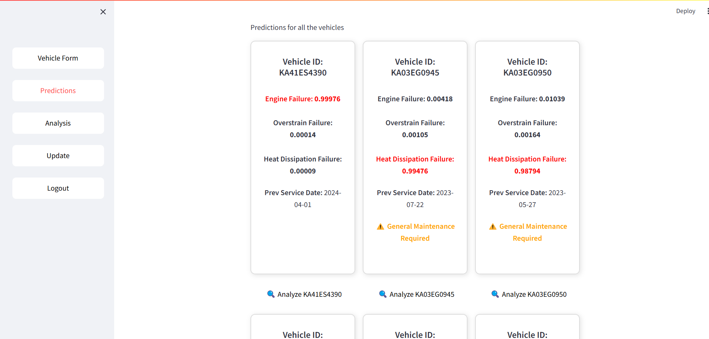
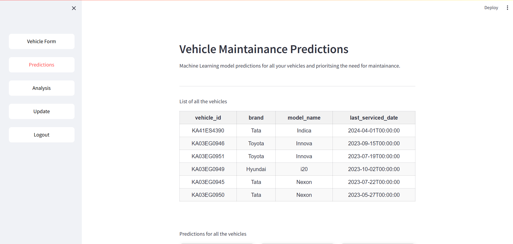
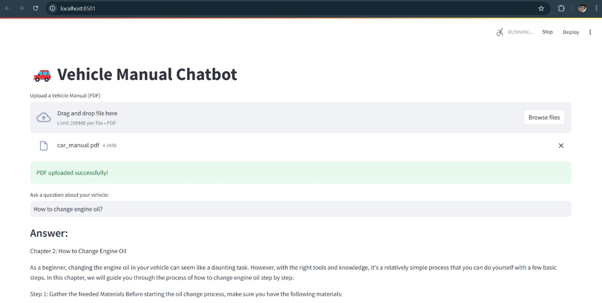

# Predictive Analysis of Vehicles

This project leverages Streamlit and Supabase to analyze vehicle data and provide predictive maintenance insights using an LLaMA 2 model.

## Prerequisites
Ensure that Python is installed on your system before proceeding.

## Setup Instructions

### 1. Create a Virtual Environment
```sh
python -m venv venv
source venv/bin/activate  # On macOS/Linux
venv\Scripts\activate  # On Windows
```

### 2. Install Dependencies
```sh
pip install -r requirements.txt
```

### 3. Configure Supabase
1. Create a `.env` file and add your Supabase key and URL:
   ```
   SUPABASE_URL=<your_supabase_url>
   SUPABASE_KEY=<your_supabase_key>
   ```
2. In Supabase, create a PostgreSQL database named `vehicles`.
3. Set up authentication with no validation.
4. Create storage named `manuals`.
5. Use the following SQL query to create the required table:
   ```sql
    CREATE TABLE vehicles (
        id SERIAL PRIMARY KEY,
        user_id UUID NOT NULL,
        vehicle_id TEXT NOT NULL,
        brand TEXT NOT NULL,
        model_name TEXT NOT NULL,
        last_serviced_date TIMESTAMP NOT NULL,
        added_on TIMESTAMP DEFAULT CURRENT_TIMESTAMP,
        last_modified TIMESTAMP DEFAULT CURRENT_TIMESTAMP ON UPDATE CURRENT_TIMESTAMP,
        vehicle_speed_sensor FLOAT NOT NULL,
        vibration FLOAT NOT NULL,
        engine_load FLOAT NOT NULL,
        engine_coolant_temp FLOAT NOT NULL,
        engine_rpm FLOAT NOT NULL,
        mass_air_flow_rate FLOAT,
        engine_oil_temp FLOAT,
        speed_gps FLOAT,
        turbo_boost_and_vcm_gauge FLOAT,
        trip_distance FLOAT,
        litres_per_100km_inst FLOAT,
        co2_in_g_per_km_inst FLOAT,
        trip_time_journey FLOAT,
        manual_link TEXT,
        score FLOAT
    );

   ```

### 4. Install and Run LLaMA 2
Ensure `ollama` is installed and run the LLaMA 2 model:
```sh
ollama run llama2
```

### 5. Run the Application
```sh
streamlit run app.py
```


##  SC of the current project 

### Screenshots of the Current Project

Here are some screenshots of the project:


*Home page of the application*


*Detailed view of all vehicle's data.*


*Form to add all the details of the particualar vehicle.*


*Prediction result.*


*vehicle details in the predictions tab*



*llm rag page*